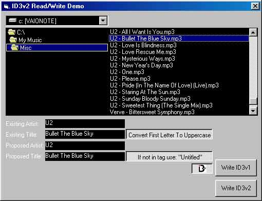



## ID3v2/ID3v1 Read and Write Demo

### Description

This small app. contains code to read/write ID3v1 and ID3v2 Tags from/to MP3 files. This code is used in one of my commercial applications. Please vote for me if you like it, it took many hours of development, specially the ID3v2 part (see ID3v2.org for specs.)
 
### More Info
 
Make copies of your mp3 files before experimenting with them. ID3v1 only supports small tags of 30 characters or so, while ID3v2 supports much more.

             |
---                |---
**Submitted On**   |2001-06-30 23:54:40
**By**             |[Luis Cantero](https://github.com/Planet-Source-Code/PSCIndex/blob/master/ByAuthor/luis-cantero.md)
**Level**          |Intermediate
**User Rating**    |4.8 (62 globes from 13 users)
**Compatibility**  |VB 6\.0
**Category**       |[Complete Applications](https://github.com/Planet-Source-Code/PSCIndex/blob/master/ByCategory/complete-applications__1-27.md)
**World**          |[Visual Basic](https://github.com/Planet-Source-Code/PSCIndex/blob/master/ByWorld/visual-basic.md)
**Archive File**   |[ID3v2\_ID3v21977712001\.zip](https://github.com/Planet-Source-Code/luis-cantero-id3v2-id3v1-read-and-write-demo__1-24603/archive/master.zip)

